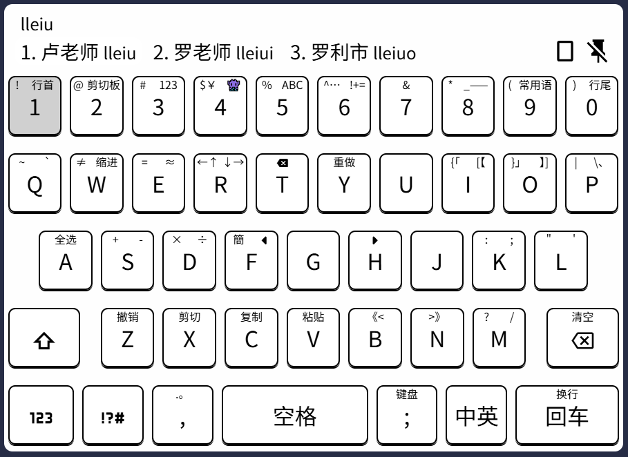

# 「四方宇 Tetrapath」仓输入法键盘布局方案

### 特性

1. 充分采用按键四个方向上的滑动。字符分配符合直觉且误触损害小。
2. 标点符号与主流电脑键盘键位匹配

### 预览方法

将配置文件导入[lost-melody.github.io/hamster-tools](https://lost-melody.github.io/hamster-tools/)即可预览和编辑

### 使用

1. 使用 iOS 上的 Hamster 仓输入法
2. 在 `键盘设置 - 键盘布局` 中添加键盘布局，选中本配置文件即可